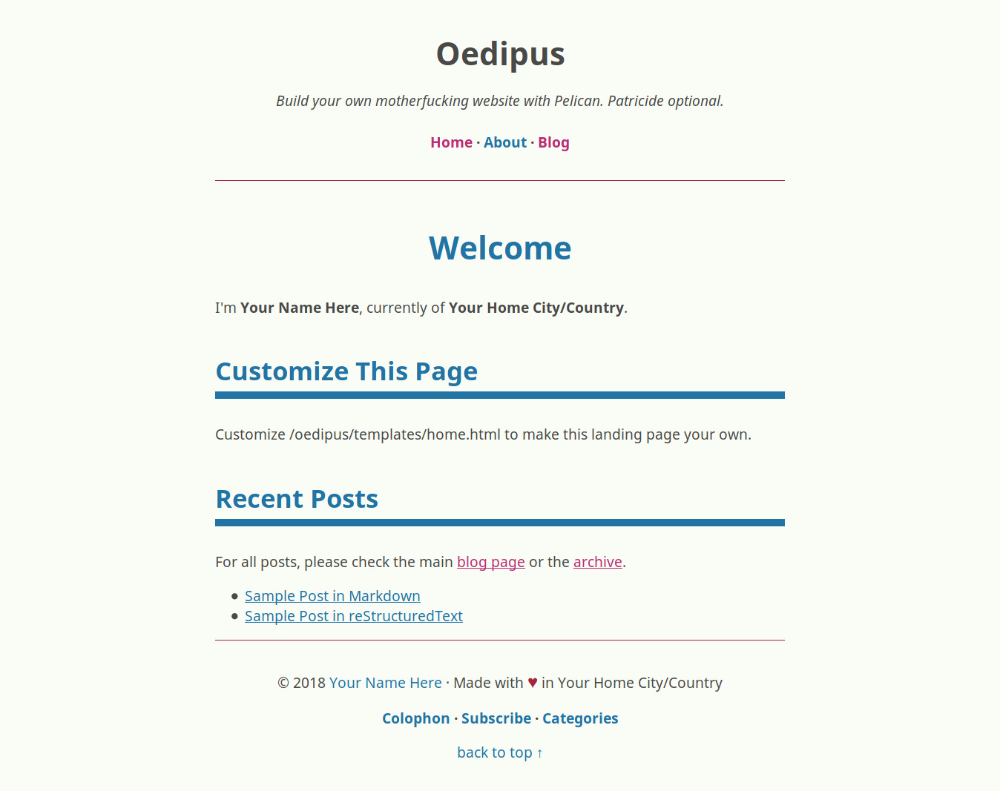

# Oedipus: a starter kit for Pelican

Build your own motherloving website using Pelican. Patricide optional.



## What's a "motherloving website"?

It's what you call a [mother*fucking*](http://motherfuckingwebsite.com)
[website](http://bettermotherfuckingwebsite.com) when you want to be
polite and not run roughshod over random strangers' delicate
sensibilities.

A motherloving website is one that uses the least amount of CSS necessary
to present its mostly textual content in an acceptable manner. The
original used no CSS at all. Its successor only used seven lines worth. My
take on the concept uses quite a bit more, but not so much that the
stylesheet is heavier than the HTML.

## What do I need in order to use it?

You'll need a working Python installation for Pelican, Jinja 2.10, and the
various plugins. You'll also need the following additional tools:

* GNU make if you want to use the Makefile
* Sass if you want to customize and rebuild the stylesheet.
* rsync
* ssh

You might also want the following:

* optipng and/or pngcrush to optimize PNG images
* jpegoptim and/or jpegtran to optimize JPEG images

## How do I use it?

1. In your terminal, run ```git clone --recursive -j8 git://github.com/matthewgraybosch/oedipus-pelican-starter.git```
2. Open up ```pelicanconf.py``` in your favorite editor and change settings as needed.
3. Open up ```publishconf.py``` in your favorite editor and set ```SITE_URL```.
4. Edit ```oedipus/templates/home.html``` to customize your home page.
5. Edit pages in ```content/pages/``` to taste.
6. Replace content in ```content/posts/``` with your own blog posts.
7. Edit Makefile to set your Python 3 path, your Sass path, and to set up your deployment method.
8. When you're ready, follow deployment instructions from Pelican's documentation.

PS: Keep [the Pelican manual](http://docs.getpelican.com/en/stable/) handy if you aren't already familiar with Pelican -- especially if you have prior experience with static site generators like Jekyll or Hugo. Things are a little different here.

## What about plugins?

Pelican has a wealth of plugins, and if you cloned this repo as instructed you'll have them in the ```pelican_plugins``` directory. The following plugins are enabled by default:

* readtime
* sitemap

You can change this by editing ```pelicanconf.py```. Please note that neither 
*readtime* nor *sitemap* list any dependencies. If you choose to enable plugins, 
please read their respective README files and install any necessary dependencies.

## Will you support this?

It depends on what you mean by support. I'm using this for my [personal
website](https://www.matthewgraybosch.com) and for a few other sites. I'm
making it available because it's useful to me and might be useful to
others. I'm open to pull requests if you want to improve upon my work.

If you're having trouble using this for your own website, file an issue. 
If I don't get to it in a reasonable amount of time, you might have to find 
me on [Mastodon](https://octodon.social/@starbreaker) and ask me directly.

## Code of Conduct

I'd like to stick with the short version if at all possible.

1. If you mess with me, I'll kick you out. This is your only warning.
2. If you mess with other contributors or users for *any* reason, you're
   messing with me. When in doubt, please refer to rule 1.

If this isn't enough, there's always the [long version from Geek
Feminism](https://geekfeminism.org/about/code-of-conduct/). 

I'd rather not have to paste that monstrosity into this project, so please
don't make it necessary.

## Are the Oedipus jokes necessary?

My cats think so.

[](https://www.flickr.com/photos/carolemage/9665213064)
Photo Credit: **Oedipus and the Sphinx of Thebes, Red Figure Kylix, c. 470
BC, from Vulci, attributed to the Oedipus Painter, Vatican Museums - Photo
by Carole Radatto**.
